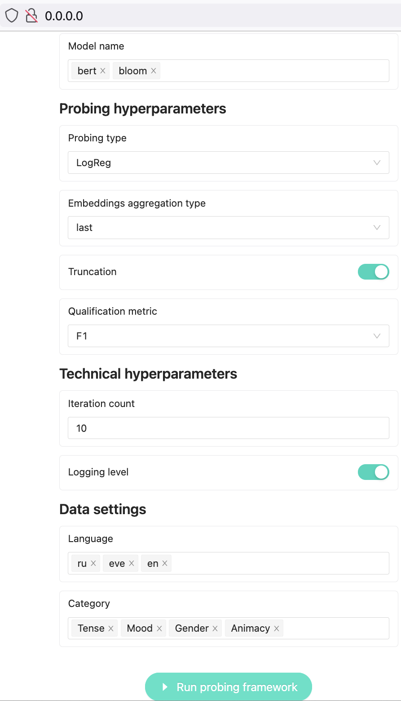
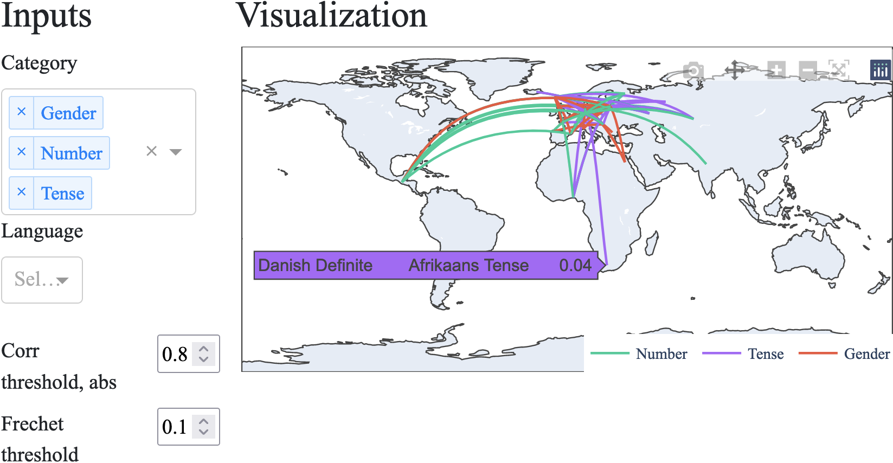

# Readme for Probing Framework

Probing Framework provides a full pipeline for probing experiments, i. e. experiments for interpretation of large language models (for more see About Probing). In a nutshell, Probing Framework supports:

- automatic generation of probing tasks on the basis of [Universal Dependencies](https://universaldependencies.org/) annotation;
- generation of probing tasks based on manual queries to data in the [CONLL-U](https://universaldependencies.org/format.html) format;
- basic probing experiments with several classifers, such as Logistic Regression and Multilayer Perceptron;
- other probing methods, such as Minimum Description Length (MDL);
- baselines for probing experiments, such as label shuffling;
- different metrics, including standard ones (such as F1-score and accuracy) and selectivity (the difference between experiments and control tasks);
- visualisation and aggregation tools for further analysis of experiments.


### About probing

As [Conneau et al. (2018)](https://aclanthology.org/P18-1198/) state, “a probing task is a classification problem that focuses on simple linguistic properties of sentences''. The main assumption behind probing is that models require linguistic knowledge that they are tested on for better performance on natural language generation and other tasks that a model can be used for ([Saphra, 2021](https://era.ed.ac.uk/handle/1842/38154)). 

[Belinkov (2020)](https://aclanthology.org/2020.acl-tutorials.1/) classifies existing methods as **structural** and **behavioural**. 

The structutal probing method is to take **a sentence vector** from a large language model and then give it as an input to a probing classifier, for example, logistic regression. The task of this diagnostic classifier is to put a label of linguistic feature to each sentence vectors.

Behavourial probes do not require any classifier on top of vector representations from a model. An example of behavourial probes is a masking task when a language model that is probed has to fill in a masked token, for example, to put a right verb form in a sentence.

• **Structural probes**: to predict labels	          


**Behavioural probes**: to predict a word


Probing methods get critical response for relying on the resusts of logistic regression that might be biased because of the data distribution. For this reason, other probing techniques are used, such as control tasks with selectivity [(Hewitt and Liang, 2019)](https://aclanthology.org/D19-1275/) and Minimum Description Length (MDL) [(Voita and Titov, 2020](https://aclanthology.org/2020.emnlp-main.14/)). For more information about these methods see original papers and [Probing Pipeline documentation.](https://github.com/AIRI-Institute/Probing_framework/tree/main/probing)

### Web Interface

The framework allows to make queries to CONNL-U data and run probing experiments in a web interface. Moreover, the web-interface supports different visualisations of the results of probing experiments in several ways, such as charts (TBA) or a map. The web-version will be available soon.






### Getting started

1. Clone the repository with code:

```python
git clone https://github.com/AIRI-Institute/Probing_framework
cd Probing_framework/ 
```

1. Install requirements and appropriate torch version:

```python
bash cuda_install_requirements.sh
```

1. Install all other necessary packages:

```python
pip install -r requirements.txt
```

### Usage Example

Here the basic example of Framework usage is presented. For further examples, see [Probing Pipeline documentation](https://github.com/AIRI-Institute/Probing_framework/tree/main/probing).

```python
from probing.pipeline import ProbingPipeline

experiment = ProbingPipeline(
        hf_model_name="bert-base-uncased",
        device="cuda:0",
        metric_names=["f1", "accuracy"],
        encoding_batch_size=32,
        classifier_batch_size=32)

experiment.run(probe_task=Path("example.csv").stem,
               path_to_task_file="example.csv",
               verbose=True,
               train_epochs=20,)
```

### Documentation

The framework consists of four main parts:

- Module to generate probing tasks with **automatic** **morphological** annotation out of Universal Dependencies data. See the documentation of this module [here](https://github.com/AIRI-Institute/Probing_framework/tree/main/probing/ud_parser).
- Module to generate probing tasks with **syntactic** annotation out of Universal Dependencies data based on **a user’s query**. See the documentation of this module [here](https://github.com/AIRI-Institute/Probing_framework/tree/ud_filter/probing/ud_filter).
- Module that provides a end-to-end pipeline for probing experiments. See the documentation of this module [here](https://github.com/AIRI-Institute/Probing_framework/tree/main/probing).
- Module that provides tools for visualisation of probing experiments. See the documentation of this module here.

### How to cite

```
@inproceedings{serikov-etal-2022-universal,
    title = "Universal and Independent: Multilingual Probing Framework for Exhaustive Model Interpretation and Evaluation",
    author = "Serikov, Oleg  and
      Protasov, Vitaly  and
      Voloshina, Ekaterina  and
      Knyazkova, Viktoria  and
      Shavrina, Tatiana",
    booktitle = "Proceedings of the Fifth BlackboxNLP Workshop on Analyzing and Interpreting Neural Networks for NLP",
    month = dec,
    year = "2022",
    address = "Abu Dhabi, United Arab Emirates (Hybrid)",
    publisher = "Association for Computational Linguistics",
    url = "https://aclanthology.org/2022.blackboxnlp-1.37",
    pages = "441--456",
    abstract = "Linguistic analysis of language models is one of the ways to explain and describe their reasoning, weaknesses, and limitations. In the probing part of the model interpretability research, studies concern individual languages as well as individual linguistic structures. The question arises: are the detected regularities linguistically coherent, or on the contrary, do they dissonate at the typological scale? Moreover, the majority of studies address the inherent set of languages and linguistic structures, leaving the actual typological diversity knowledge out of scope.In this paper, we present and apply the GUI-assisted framework allowing us to easily probe massive amounts of languages for all the morphosyntactic features present in the Universal Dependencies data. We show that reflecting the anglo-centric trend in NLP over the past years, most of the regularities revealed in the mBERT model are typical for the western-European languages. Our framework can be integrated with the existing probing toolboxes, model cards, and leaderboards, allowing practitioners to use and share their familiar probing methods to interpret multilingual models.Thus we propose a toolkit to systematize the multilingual flaws in multilingual models, providing a reproducible experimental setup for 104 languages and 80 morphosyntactic features.",
}
```
