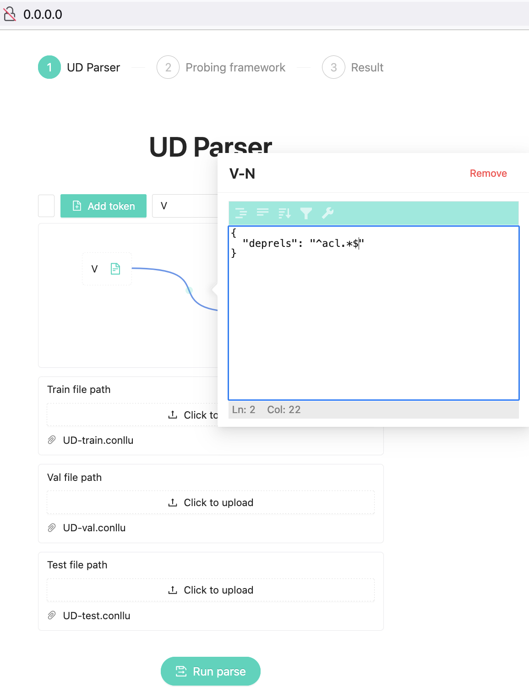
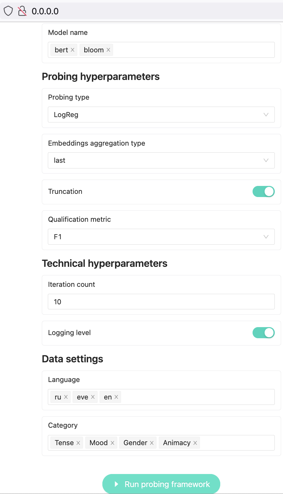
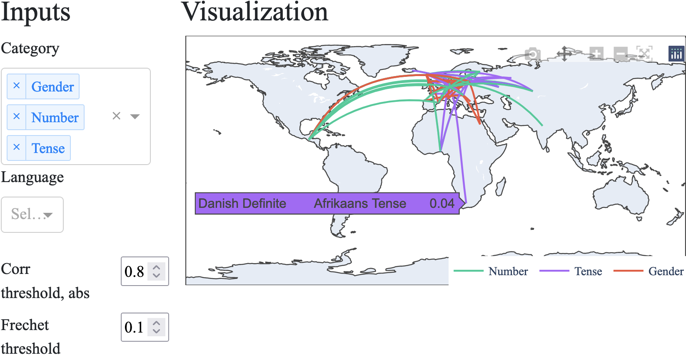

### Web Interface

The framework allows to make queries to CONNL-U data and run probing experiments in a web interface. Moreover, the web-interface supports different visualisations of the results of probing experiments in several ways, such as charts (TBA) or a map. The web-version will be available soon.

